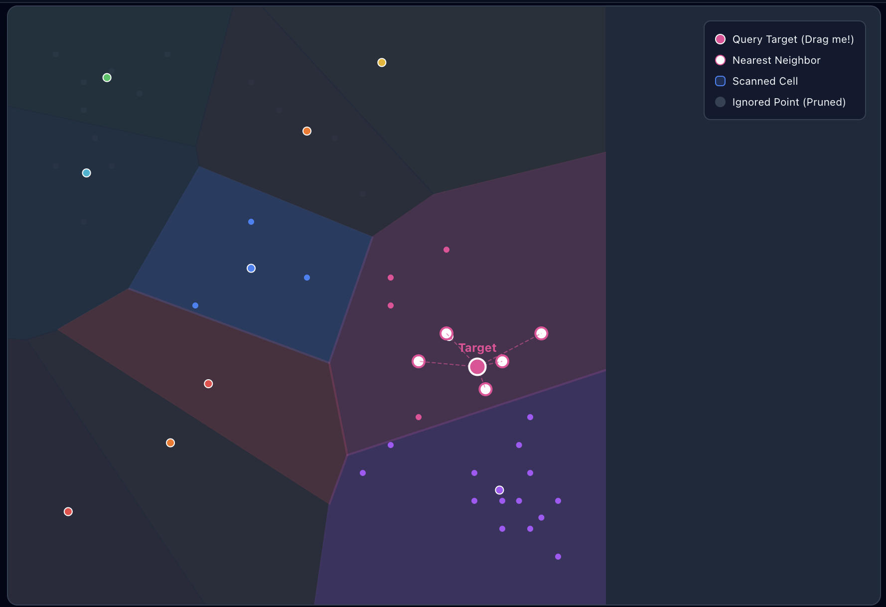
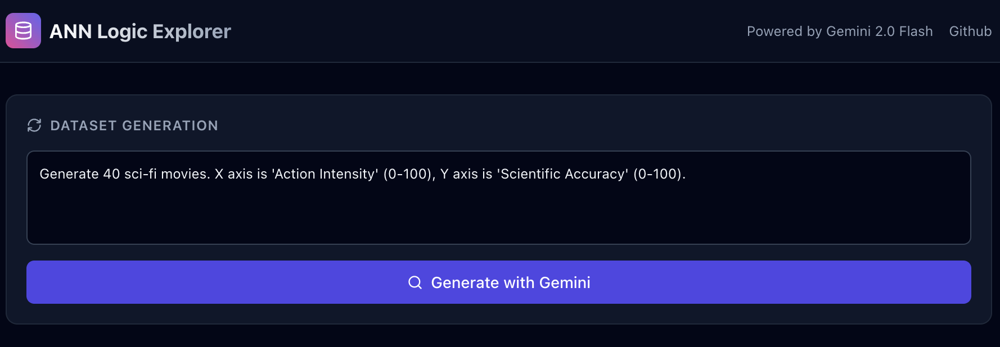
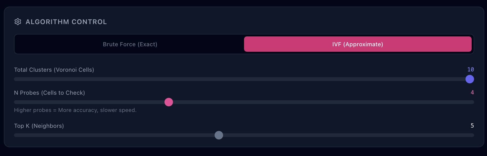
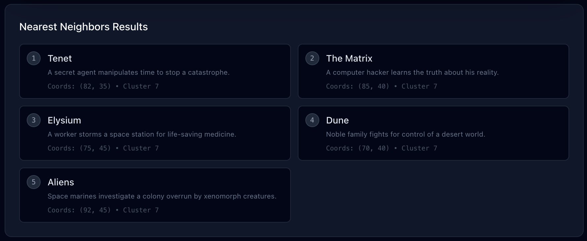

# ANN Logic Explorer

An interactive educational tool to visualize how **Approximate Nearest Neighbor (ANN)** search algorithms work, specifically focusing on the **Inverted File Index (IVF)** method.

This application demonstrates the trade-off between search speed (scanned points) and accuracy (recall) using real-time interactive visualizations.

## Features

- **Generative Datasets**: Uses **Google Gemini 2.0 Flash** to generate semantic datasets (e.g., "Sci-Fi Movies", "Spicy Foods") with meaningful 2D coordinates.
- **Interactive Visualization**:
  - **D3.js** powered graph showing data points and cluster boundaries (Voronoi cells).
  - Draggable "Query Target" to see nearest neighbors update in real-time.
- **Algorithm Comparison**:
  - **Brute Force**: Visualizes checking every single point (100% accuracy, slow).
  - **IVF (Inverted File Index)**: Visualizes the "Cluster & Probe" approach (faster, approximate).
- **Real-time Tuning**: Adjust `N Clusters`, `N Probes`, and `Top K` to observe how they affect the search radius and accuracy.

## Tech Stack

- **Frontend**: React 19, TypeScript
- **Visualization**: D3.js
- **AI Integration**: Google GenAI SDK (`@google/genai`)
- **Styling**: Tailwind CSS, Lucide React

## Interface Overview

### Main Window
The core visualization showing Voronoi cells, data points, and the search radius.


### Dataset Generation
Generate semantic datasets using Gemini.


### Algorithm Control
Toggle between Brute Force and IVF, and tune parameters like N-Probes.


### Performance Metrics
Real-time feedback on points scanned versus accuracy (Recall).


### Nearest Neighbors Results
The resulting items found by the algorithm.


## Setup & Run

1. **Install Dependencies**
   ```bash
   npm install
   ```

2. **Set API Key**
   You need a Google Gemini API Key.
   ```bash
   export API_KEY="your_gemini_api_key_here"
   ```

3. **Start the Dev Server**
   ```bash
   npm run start
   ```

## How to Use

1. **Generate Data**: Enter a prompt (e.g., "50 famous rock bands") and click "Generate". Gemini will create data points positioned by semantic meaning.
2. **Drag the Target**: Move the pink "Target" dot around the canvas.
3. **Switch Algorithms**:
   - Select **Brute Force** to see the baseline (checking all points).
   - Select **IVF** to see the optimization.
4. **Tune Parameters**:
   - **Total Clusters**: Re-runs K-Means to divide the space into more/fewer cells.
   - **N Probes**: Controls how many neighboring cells are checked. Increase this to improve accuracy (Recall) at the cost of scanning more points.

## The Logic (IVF)

**Inverted File Index (IVF)** works by clustering the vector space.
1. **Training**: We use K-Means to group points into clusters (Voronoi cells).
2. **Indexing**: Each point is assigned to a specific cluster ID.
3. **Searching**:
   - Instead of checking every point, we identify which cluster the query point falls into.
   - We only scan points within that cluster (and `n` nearest neighboring clusters/probes).
   - This drastically reduces the number of distance calculations required.
